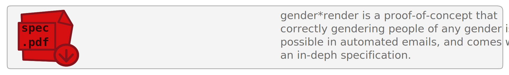

Template-system for rendering gender-neutral text- and email-templates properly gendered and with the correct pronouns of all people involved.

Ever had the struggle of correctly gendering people in your automated emails? Are you sick of writing email templates that are unsupportive of non-binary people, gender everyone with ugly underscores, or clumsily avoid pronouns alltogether, costing you hours of work to frickle them together? With gender\*render, you can write easy, gender-neutral templates for your emails, and automatically render them into correctly gendered emails, given the pronouns and names of all people concerned! [[Jump to usage examples]](#example-usages)

Gender\*render is not only a piece of software that can definitely come in handy if you want to write progressive automated emails, but also a proof of concept. Many people say that correctly gendering nonbinary people, people with unusual pronouns, or people with no pronouns at all in automated ashions is impossible. And many live by said premise. gender\*render as a concept is supposed to be a proof that this is simply false, and that any such claims stem from a mixture of missing will and lazyness, with technical limitations merely being a pretext. Gender\*render comes with an in-deph specification so you can easily implement it in any language of your choice, port it to other (human) languages or read about the thoughts behidn this project! [[Download spec]](https://github.com/phseiff/gender-render/raw/main/docs/spec.pdf)

## Advantages/Features:

Using gender\*render offers a set of advantages over traditional "one for men and one for women"-email templates:

* Comes as a simple python module, but the concept is easily portable.

* Easy enough for non-tech people to write templates with it.

* Supports addressing individuals in first person as well as mentioning them in third person.

* Supports addressing *multiple* as well as only addressing a single individual with unknown pronoun preferences.

* Supports ANY pronoun-sets or forms of addressing, including pronoun-less identities.

* Comes with a specification so you can easily port it to other (natural or programming) languages.

* Aids you you in being a decent human being by correctly genering persons in your automated emails!

If your web forms ask your customers for their pronoun preferences instead of their gender, preferably with text entry boxes instead of dropdowns, and you have these pronoun information in a nice data base, you can easily automate the process of correctly gendering your emails based on the person they are directed to. In fact, using gender\*render might even save you time in the end, since you need to write only one template with it instead of two templates for "two" different genders.

## Table of content:

1. [Template syntax](#template-syntax)
2. [Describing pronoun-use with json data](#describing-pronoun-use-with-json-data)
3. [Installing and using the renderer](#installing-and-using-the-renderer) (implementation-specific)
3. [The renderer API](#the-renderer-api) (not implementation-specific)

## Content:

### Template syntax

### Describing pronoun-use with json data

### Installing and using the renderer

### The renderer API

## Developement:

This tool uses [README-driven developement](https://tom.preston-werner.com/2010/08/23/readme-driven-development.html). Issues are welcome and addressed as fast as possible, especially is they address political issues with the project.
